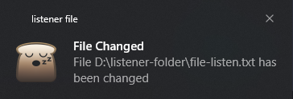

## UMA APLICAÇÃO SIMPLES PARA OUVIR ALTERAÇÕES EM UM ARQUIVO ESPECIFICO

Esta aplicação ouve alterações em um arquivo especificado e printa no console que ouve alteração. Não foi realizado nenhuma ação após isso, mas pode ser feita varias ações como enviar um e-mail quando o arquivo for alterado, gerar uma notificação visual ou sonora, gerar ações a partir da ação no arquivo, enfim varias ações.

As tecnologias utilizadas foram:

- `Node.js`

- `chokidar`

- `node-notifier`

## COMO FUNCIONA?

Inicialmente instale as dependências: `yarn install` ou `npm install`

Depois rode os comandos:
`yarn start` ou `npm start`

Em seguida execute alterações no arquivo `file-listen.txt`, você vera uma mensagem parecida com essa no terminal:

```console
File D:\listener-folder\file-listen.txt has been changed
```

Você também vai ser notificado, como a seguir:


